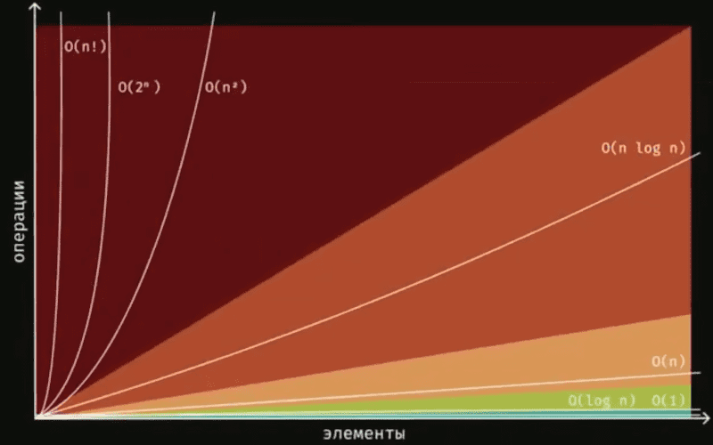

# Big-O
## Для чего надо знать о Big-O?
<p align="justify"> Big-О позволяет оценивать алгоритмы по времени их работы и по потреблению ими памяти, причем рассматривает всегда худший вариант.</p>
<p align="justify"><font>✔️</font> Big-О позволяет уметь видеть и исправлять неоптимальный код.</p>
<p align="justify"><font>✔️</font> Если вы не знаете что такое Big-O, то вы не понимаете, что вы написали.</p>
<p align="justify"><font>✔️</font> Без Big-O не обходится ни один проект и ни ОДНО собеседование.</p>
<p align="justify"><font>✔️</font> Без применения Big-O на практике, производительность вашей системы очень сильно страдает.</p>

## Виды оценок
<p align="justify"><font>Big-O</font> (Big O) обозначает верхнюю границу сложности алгоритма. Это идеальный инструмент для поиска худшего варианта.</p>
<p align="justify"><font>Big-Ω</font> (Big Omega) обозначает нижнюю границу сложности, и её правильнее использовать для поиска лучшего варианта.</p>
<p align="justify"><font>Big-Θ</font> (Big Theta) располагается между О и Ω и показывает точную функцию сложности алгоритма. С её помощью правильнее искать среднего варианта.</p>
<p align="justify"><font>Small o</font> (small o) и <font>Small ω</font>(small omega) находятся по краям этой иерархии и используются в основном для сравнения алгоритмов между собой.</p>

<p align="justify"> Big-O – это математическая модель, которая показывает скорость роста зависимости между входными
параметрами функции и количеством операций, которые выполнит процессор.</p>

## Как выглядит эта нотация?
<p align="justify"> Буква О говорит о том, что это Big-O, а в скобках описано поведение алгоритма, причем внутри их может быть все что угодно, ну или почти </p>
<p align="justify"><font>✔️ </font>O(n^2+n) <font style="margin-left: 145px;">✔️ </font>O(1)</p>
<p align="justify"><font>✔️ </font>O(10*2^n + 100*n^1000) <font style="margin-left: 50px;">✔️ </font>O(log n)</p>
<p align="justify"><font>✔️ </font>O(n^2+x) <font style="margin-left: 145px;">✔️ </font>O(n)</p>
<p align="justify"><font>✔️ </font>O(x+y) <font style="margin-left: 160px;">✔️ </font>O(nlogn)</p>
<p align="justify"><font>✔️ </font>O(x*y) <font style="margin-left: 163px;">✔️ </font>O(n^2)</p>
<p align="justify"><font>✔️ </font>O(100) <font style="margin-left: 160px;">✔️ </font>O(2^n)</p>
<p align="justify"><font>✔️ </font>O(5n)<font style="margin-left: 170px;"> ✔️</font>O(n!)</p>

## Неважная сложность
<p align="justify"><font>✔️</font>O(100) = O(1)</p>
<p align="justify"><font>✔️</font>O(5n) = O(n)</p>
<p align="justify"><font>✔️</font>O(n^2+n) = O(n^2)</p>
<p align="justify"><font>✔️</font>O(n + log n) = O(n)</p>
<p align="justify"><font>✔️</font>O(10*2^n+100*n^1000) = O(2^n+n^1000) = O(2^n)</p>
<p align="justify"><font>✔️</font>O(n^2+x) = O(n^2+x)</p>
<p align="justify"><font>✔️</font>O(x+y) =0(x+y)</p>
<p align="justify"><font>✔️</font>O(x*y) = O(x*y)</p>

## Базовые Big-O
В разработке это наиболее часто встречаемые варианты Big-O


### O(1)
<p align="justify">Можно прочитать как «сложность порядка 1», или «алгоритм выполняется за постоянное/константное время» (constant time).</p>
<p align="justify">O(1) алгоритмы самые эффективные.</p>

```swift
func sum(_ a: Int, _ b: Int) -> Int {
	a + b
}
```

<p align="justify">Но стоит помнить, что постоянное время выполнения не равно быстрому алгоритму. Если у вас есть алгоритм, который вне зависимости от количества элементов будет вести обработку час, то его сложность тоже будет записываться как O(1).</p>

```swift
let array = [0, 1, 2, 3, 4, 5, 6, 7, 8, 9]
print(array[2])
```

<p align="justify">Получение по индексу в массиве, или по ключу в словаре в нотации Big-O это будет O(1)</p>

### O(n)
<p align="justify">Линейное время O(n): функция работает за линейное время, потому что ее скорость зависит от размера входных данных.</p>

<p align="justify">Когда каждый элемент в массиве должен быть обработан, чтобы функция достигла своей цели, мы должны пройти по всему массиву. Это означает, что функция становится менее эффективной по мере увеличения количества элементов.</p>

<p align="justify">Рассмотрим пример рекурсивной функции, которая складывает числа:</p>

```swift
func sumSequence(_ n: Int) -> Int {
	if n == 1 { return 1 }
	return n + sumSequence(n - 1)
}
```

<p align="justify">Очевидно, что у этого алогритма `sumSequence` сложность описывается как O(n), так как чем больше число N, тем большее количество раз функция будет вызывать саму себя.</p>

<p align="justify">Мы можем развернуть рекурсию и сделать тоже самое, но уже без рекурсивного вызова:</p>

```swift
func sum(_ a: Int, _ b: Int) -> Int {
	a + b
}

func sumSequence2(_ n: Int) -> Int {
	var total = 0
	for i in 0...n {
		total = sum(total, i)
	}
	return total
}
```

<p align="justify">Сложность же функции `sum`, это O(1), так как тут всего лишь сложение 2х чисел и оно всегда будет требовать одинаковых затрат. А вот сложность `sumSequence` как и при рекурсии, тоже O(n), так как нам придется пройтись в цикле по всем n элементам.</p>

```swift
let array = [0, 1, 2, 3, 4, 5, 6, 7, 8, 9]

for item in array {
	print(item)
}

for item in array {
	print(item)
}
```

<p align="justify">Тут сложность O(n + n) = O(n)</p>
<p align="justify">Перебор коллекции это O(n)</p>

### O(n^2)

<p align="justify">Квадратичное время O(n^2): если сложность функции растет квадратично (это означает, что для N элементов массива сложность функции равна n в квадрате).</p>

```swift
let array = [0, 1, 2, 3, 4, 5, 6, 7, 8, 9]

for item in array {
	for item2 in array {
		print("\(item), \(item2)")
	}
}
```

<p align="justify">Cложность O(n * n) = O(n^2)</p>
<p align="justify">Обычно это функции с вложенными циклами. Два вложенных цикла приводят к сложности O(n^2), три вложенных цикла приводят к сложности O(n^3) и так далее...</p>

### O(log N)

<p align="justify">Логарифмическая O(log n): сложность функций логарифмически минимизируется, когда размер ее входных данных N растет.</p>

<p align="justify">Такая сложность характерна для алгоритма, где на каждой итерации берется половина элементов, например, алгоритм бинарного поиска.
<p align="justify">Чтобы было проще понять, откуда берется log и что он означает, давайте вспомним такой алгоритм, как бинарный поиск. Он работает на заранее упорядоченном массиве.</p>

<p align="justify"> - Взять середину массива;</p>
<p align="justify"> - Сравнить число с серединой. Если оно меньше середины, то ищем в левой части массива. Если число больше, ищем в правой части массива;</p>
<p align="justify"> - Повторим проверку для подмассива;</p>
<p align="justify"> - Закончим, если найдем нужный элемент или длина подмассива будет 1.</p>

```swift
func binarySearch<T: Comparable>(items: [T], target: T) -> Int? {
	guard !items.isEmpty else { return nil }
	
	var start = 0
	var end = items.count - 1
	while start <= end {
		let middleIndex = (start + end) / 2
		let middleValue = items[middleIndex]
		
		if middleValue == target {
			return middleIndex
		} else if target < middleValue {
			// ищем в левой части массива
			end = middleIndex - 1
		} else {
			// ищем в левой части массива
			start = middleIndex + 1
		}
	}
	
	return nil
}
```

<p align="justify">Итак, из-за того, что мы каждую итерацию пробегаем только половину массива, получается, что во второй итерации мы обрабатываем n/2, а в третьей n/4...</p>

<p align="justify">Допустим, что наш массив размером в 64 элементов, тогда наши итерации будут таковыми:</p>

- n = 64 // 2^6
- n = 32 // 2^5
- n = 16 // 2^4
- n = 8  // 2^3
- n = 4  // 2^2
- n = 2  // 2^1
- n = 1  // 2^0

<p align="justify">Так как 2^k = n, то результат выглядит как необходимость выполнения k = log2(n) операций.</p>

<p align="justify">O(log n) такую сложность имеет алгоритм «бинарный поиск».</p>

### O(2^n)

<p align="justify">Алгоритмы с экспоненциальным временем выполнения O(2^n) часто являются рекурсивными алгоритмами, которые решают задачу размера n путем рекурсивного решения двух меньших задач размера n-1.</p>

<p align="justify">Ханойская башня является одной из популярных головоломок XIX века. Даны три стержня, на один из которых нанизаны восемь колец, причём кольца отличаются размером и лежат меньшее на большем. Задача состоит в том, чтобы перенести пирамиду из восьми колец за наименьшее число ходов на другой стержень. За один раз разрешается переносить только одно кольцо, причём нельзя класть большее кольцо на меньшее.</p>

<p align="justify">В следующем примере выводятся все ходы, необходимые для решения знаменитой задачи «Ханойские башни» для n дисков с помощью рекурсии.</p>

```swift
func solveHanoi(n: Int, from: String, to: String, spare: String) {
	if n != 0 {
		solveHanoi(n: n - 1, from: from, to: spare, spare: to)
		print("\(from) -> \(to)")
		solveHanoi(n: n - 1, from: spare, to: to, spare: from)
	}
}
```

<p align="justify">Или вычисление чисел Фибоначчи.</p>

<p align="justify"><p align="justify">Чи́сла Фибона́ччи — элементы числовой последовательности.</p>

0, 1, 1, 2, 3, 5, 8, 13, 21, 34, 55, 89, 144, 233, 377, 610, 987, 1597, 2584, 4181, 6765, 10946, 17711, …</p>

<p align="justify">Последовательность, в которой первые два числа равны 0 и 1, а каждое последующее число равно сумме двух предыдущих чисел. Названы в честь средневекового математика Леонардо Пизанского (известного как Фибоначчи).</p>

```swift
func fibs(_ n: Int) -> Int {
	if n < 2 { return n }
	return fibs(n - 1) + fibs(n - 2)
}
```

### O(n!)

<p align="justify">Факториальные алгоритмы.</p>

<p align="justify">Самый тривиальный пример функции, которая занимает O(n!) времени -- это расчет факториала.</p>

```swift
func nFactFunc(n: Int) {
	for _ in stride(from: 0, to: n, by: 1) {
		nFactFunc(n: n - 1)
	}
}
```

<p align="justify">Но есть и другие задачи, решения которых будет иметь такую оценку сложности.</p>

<p align="justify">Задача про курьера, где необходимо проложить кротчайший путь между адресами таким образом, чтобы он посетил все адреса и вернулся обратно. Для решения этой задачи необходимо перебрать все возможные варианты.</p>
<p align="justify">Подробнее можно прочитать в книге "Грокаем алгоритмы (Адитья Бхаргава)"</p>

## Вычисление BigO

### Сложение сложностей

```swift
func sum(arrayA: [Int], arrayB: [Int]) -> Int {
	var result = 0
	for item in arrayA { // k
		result += item // 1
	}
	for item in arrayB { // l
		result += item // 1
	}
	return result
}
```

<p align="justify">Сложностью алгоритма будет: O((k * 1) + (l * 1)) = O(k+l)</p>

### Умножение сложностей

```swift
func sum2(arrayA: [Int], arrayB: [Int]) -> Int {
	var result = 0
	for itemA in arrayA { // m
		for itemB in arrayB { // n
			result += itemB + itemA //1
		}
	}

	return result
}
```

<p align="justify">Сложностью алгоритма будет: O(m * (n * 1)) = O(mn)</p>

## Рекурсия

<p align="justify">Для одного рекурсивного вызова сложность - O(n), т.к. foo будет вызвана N раз:</p>

```swift
func foo(n: Int) -> Int {
	if n == 1 { return n }
	return foo(n: n-1)
}
```

<p align="justify">Для двух рекурсивных вызовов сложность экспоненциальная - O(2^n):</p>

```swift
func bar(n: Int) -> Int {
	if n == 1 { return n }
	return bar(n: n-1) + bar(n: n-1)
}
```

## BigO в цифрах

<p align="justify">Для закрепления материала, давайте посмотрим, насколько сильно отличаются Big-O в конкретных цифрах. Для этого представим, что мы обрабатываем массив размеров в n элементов и вычислим все Big-O значения.</p>

```swift
import Foundation

final class CalcBigO {
	
	public func calc(n: Double) -> [Double] {
		var result: [Double] = []
		
		result.append(cacl_O_1(n: n))
		result.append(cacl_O_log_n(n: n))
		result.append(calc_O_n(n: n))
		result.append(cacl_O_n_log_n(n: n))
		result.append(calc_O_n_2(n: n))
		result.append(calc_O_exp(n: n))
		result.append(calc_O_fact(n: n))
		
		return result
	}
	
	public func printBigO(n: Double) {
		let result = calc(n: n)
		print("O(1) Константная\t\t\t\(result[0].toString())")
		print("O(log n) Логарифмическая\t\t\(result[1].toString())")
		print("O(n) Линейная\t\t\t\t\(result[2].toString())")
		print("O(n log n) n Логарифмическая\t\(result[3].toString())")
		print("O(n^2) Квадратичная\t\t\t\(result[4].toString())")
		print("O(2^n) Экспоненциальная\t\t\(result[5].toString())")
		print("O(n!) Факториальная\t\t\t\(result[6].toString())")
	}
	
	private func cacl_O_1(n: Double) -> Double {
		1
	}
	
	private func cacl_O_log_n(n: Double) -> Double {
		log(n)
	}
	
	private func calc_O_n(n: Double) -> Double {
		n
	}
	
	private func cacl_O_n_log_n(n: Double) -> Double {
		n*log(n)
	}
	
	private func calc_O_n_2(n: Double) -> Double {
		n*n
	}
	
	private func calc_O_exp(n: Double) -> Double {
		exp2(n)
	}
	
	private func calc_O_fact(n: Double) -> Double {
		var result = 1
		if(n > 0) {
			for i in 1...Int(n) {
				result *= i
			}
		}
		return Double(result)
	}
}

extension Double {
	func toString() -> String {
		return String(format: "%.2f",self)
	}
}

// max 20
CalcBigO().printBigO(n: 20)
```

## Итого
<p align="justify"><font>✔️</font> Получение по индексу в массиве, или по ключу в словаре в нотации Big-O это будет O(1).<p align="justify"><font>✔️</font> Перебор коллекции это O(n).</p>
<p align="justify"><font>✔️</font> Два вложенных цикла приводят к сложности O(n^2), три вложенных цикла приводят к сложности O(n^3) и так далее.</p>
<p align="justify"><font>✔️</font> Алгоритм со стратегией "Разделяй и Властвуй" (Divide and Conquer), где на каждой итерации берётся половина элементов, сложность всегда будет включать O(logn).</p>
<p align="justify"><font>✔️</font> Алгоритмы с экспоненциальным временем выполнения O(2^n) часто являются рекурсивными алгоритмами.</p>
<p align="justify"><font>✔️</font> Факториальная временная сложность — наихудший тип временной сложности, потому что количество операций уже не описать Double при наборе данных более 20 элементов.</p>


