# Application architecture

## Черты хорошей архитектуры

✔️ Легко откликается на изменения требований.

✔️ Позволяет улучшить точность оценки любых изменений системы.

✔️ Гарантирует тестируемость.

✔️ Облегчает поддержание быстрого и постоянного темпа.

✔️ Не зависит от фреймворков.

✔️ Не зависит от БД, UI, железа и внешнего мира.

> Проектирование архитектуры это искусство, а не ремесло - всегда неизбежны те или иные компромиссы.

## Слои архитектуры
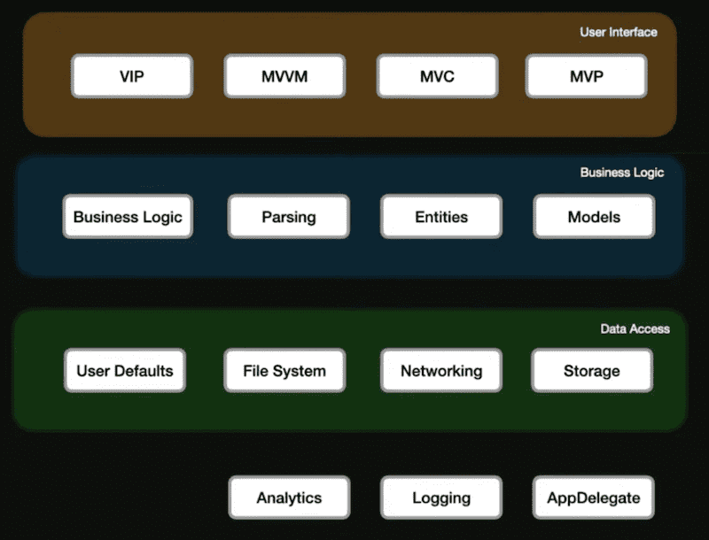

### Передача данных
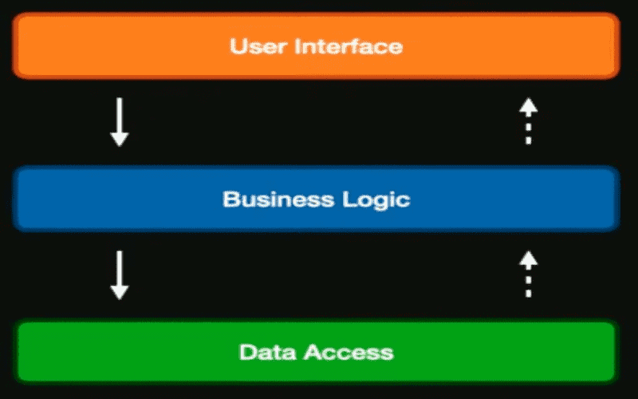

### Порядок зависимостей
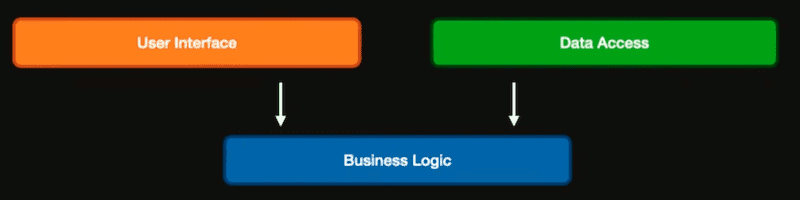

> Документирование архитектуры программного обеспечения (ПО) упрощает процесс коммуникации между разработчиками, позволяет зафиксировать принятые проектные решения и предоставить информацию о них эксплуатационному персоналу системы, повторно использовать компоненты и шаблоны проекта в других

## Определение Архитектуры

✔️ выбор структурных элементов и их интерфейсов, с помощью которых составлена система.

✔️ соединение выбранных элементов структуры и поведения в более крупные системы.

✔️ архитектурный стиль, который направляет всю организацию - все элементы, их интерфейсы, их сотрудничество и их соединение.

> Архитектура системы слабо влияет на работу системы. Существует масса систем с ужасной архитектурой, которые прекрасно работают. Их проблемы кроются не в функционировании, проблемы возникают в процессе развертывания, сопровождения и продолжительного развития&

> Архитектура гибкая, она живет и развивается параллельно с жизнью ПО.

## Декомпозиция
1. Восходящее проектирование
	2. Сначала создаем кирпичики, потом собираем их них все более сложные системы
2. Нисходящее проектирование
	1. Постепенная реализация модулей
	2. Строгое задание интерфейсов
	3. Активное использование заглушек
	4. Модули
		1. Четкая декомпозиция
		2. Минимизация
		3. Один модуль - одна функциональность
		4. Отсутствие побочных эффектов
		5. Независимость от других модулей

## Качество модулей в системе
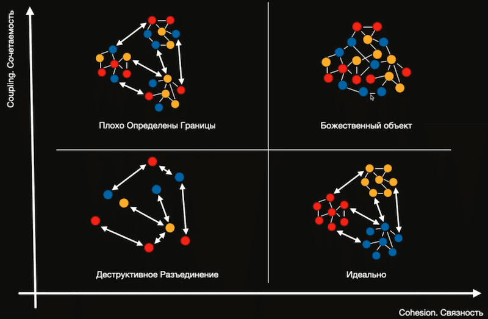

✔️ Cohesion. Связность - степень, в которой задачи, выполняемые одним модулем, связаны друг с другом. Фокусировка модуля.

✔️ Coupling. Сочетаемость - мера того, насколько взаимосвязаны разные модули в программе.

### Хорошая архитектура должна обладать:

✔️ High cohesion - Сильной связностью (направленные на решение однойчеткой задачи)

✔️ Low coupling - Слабой сочетаемостью (как можно менее зависимые от других модулей)

### Cohesion. Связность

✔️ REP: Reuse/Release Equivalence Principle -принцип эквивалентности повторного использования и выпусков.

✔️ CCP: Common Closure Principle - принцип согласованного изменения.

✔️ CRP: Common Reuse Principle - принцип совместного повторного использования.

### Coupling. Сочетаемость

✔️ ADP: Acyclic Dependencies Principle - принцип ацикличности зависимостей.

✔️ SDP: Stable Dependencies Principle - принцип устойчивых зависимостей.

✔️ SAP: Stable Abstractions Principle - принцип устойчивости абстракций.

## Области вероятных изменений

✔️ Бизнес-правила.

✔️ Зависимости от оборудования.

✔️ Ввод-вывод.

✔️ Нестандартные возможности языка, фреймворки, расширения.

✔️ Сложные аспекты проектирования и конструирования.

✔️ Переменные статуса.

✔️ Размеры структур данных.

> Тестируемость архитектуры определяет, насколько легко нам будет писать юнит-тесты, а чаще всего - сможем ли мы их писать в принципе.

## MVx

<b>Model</b> — ответственные за данные домена или слой доступа к данным, который манипулирует данным.

<b>View</b> — ответственные за уровень представления (UI); для iOS это все, что начинается с префикса UI.

<b>Controller / Presenter / ViewModel</b> — посредник между Model и View. Отвечает за изменения Model, реагируя на действия пользователя. MVC или MVP или даже MVVM.

## MVC
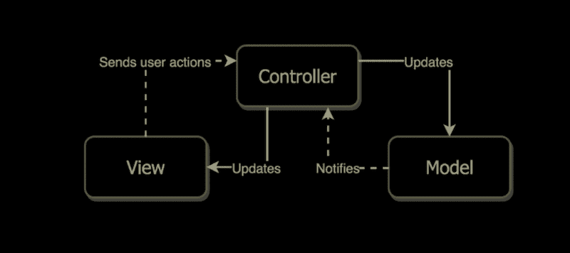
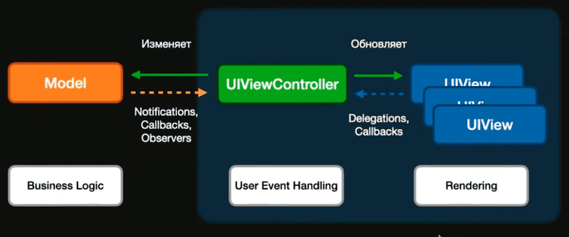

<b>Model</b> — это сущность, которая описывают объект.

<b>View</b> — это сущность, которая отвечает за пользовательский интерфейс. Всеклассы фреймворка UIKit.

<b>Controller</b> — посредник между Model и View. Отвечает за изменения модели данных, реагируя на манипуляции пользователя с интерфейсом. Так же передает данные для отображения в интерфейс, используя изменения из Model.

## MVP
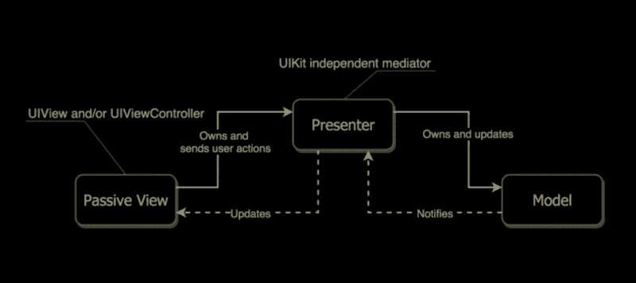
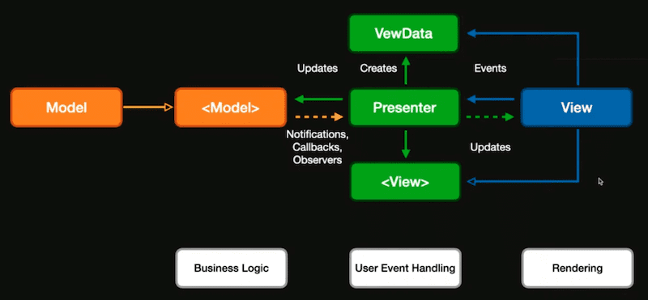

<b>Model</b> — это сущность, которая описывают объект.

<b>View</b> — это сущность, которая отвечает за пользовательский интерфейс. Всеклассы фреймворка UIKit.

<b>Presenter</b> — посредник между Model и View. Отвечает за изменения модели данных, реагируя на манипуляции пользователя с интерфейсом. Так же передает данные для отображения в интерфейс, используя изменения из Model.

## MVVM
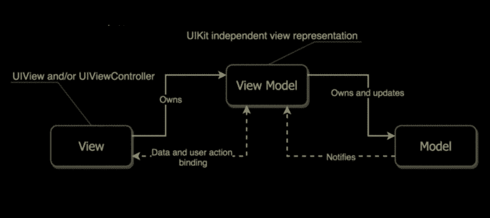
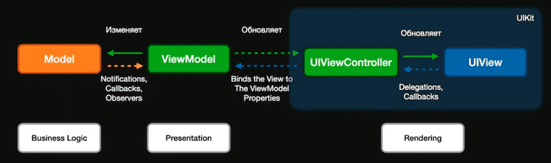

<b>Model</b> — это сущность, которая описывают объект.

<b>View</b> — представляет из себя пользовательский интерфейс, сюда же относится и вью контроллер. В данной схеме вью берет на себя часть обязанностей, выполняемых классом UIViewController.

<b>View Model</b>  — с одной стороны View Model представляет из себя статическую модель для отображения вью, т.е. модель интерфейса; а с другой — отвечает за сбор, интерпретацию и преобразование данных. Это позволяет разгрузить View Controller на столько, чтобы оставить в нем только те задачи, которые необходимы для отображения интерфейса и для реагирования на действия пользователя. При таком подходе вью контроллер выступает посредником между пользователем и моделью данных.

## VIPER
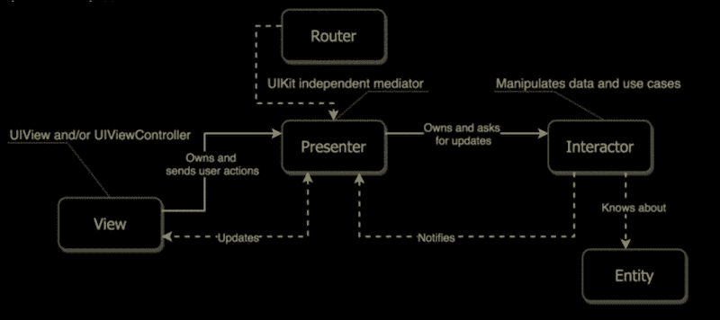

<b>View</b> — вся задача вью заключается в том, что бы отображать полученные данные в интерфейсе и перенаправлять действия пользователя в Presenter. К этому слою относится и вью контроллер.

<b>Interactor</b> — можно сравнить с контроллером, который ни чего не знает о том, как будут отображаться данные. Интерактор обрабатывает поступающие события и решает, какой сервис должен быть вызван в той или иной ситуации. Здесь реализована бизнес —логика, для работы текущего модуля. Сервисы — это вспомогательные классы, которые рассматриваются как внешние зависимости, которые не являются частями модуля VIPER. Сервисы могут взаимодействовать друг с другом и с Entity.

<b>Entity</b> — это объекты модели, не содержащие никакой бизнес —логики. Entity не является компонентом модуля VIPER.

<b>Presenter</b> — содержит бизнес —логику, связанную с пользовательским интерфейсом, но при этом не зависит от UIKit. Все действия действия пользователя передаются в Presenter, который в свою очередь решает куда перенаправлять эти действия: в Router или в Interactor. Presenter может получать данные от Interactor’a, подготавливать их и отправлять во View для отображения.

<b>Router</b> — осуществляет навигацию между модулями (экранами). В классической схеме VIPER, в качестве раутера выступает слой, который называется Wireframe. Он отвечает не только за сам переход, но и за сборку модуля, на который осуществляется этот переход, поэтому очень часто можно встретить деление этого слоя на дополнительный слой. Это может быть Assembly или Configurator, который отвечает за сборку модуля и установку зависимостей между всеми его компонентами, тогда как Router несет ответственность непосредственно за сам переход.

 
## Clesn Swift
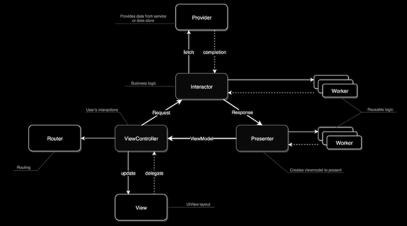
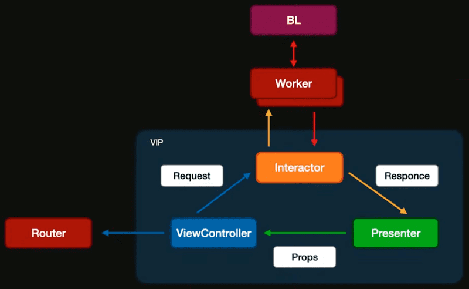

<b>View</b> — storyboard’ы, XIB’ы или UI элементы, написанные через код.

<b>ViewController</b> — отвечает только за конфигурацию и взаимодействие с View. В контроллере не должно находиться никакой бизнес логики, взаимодействия с сетью, вычислений и так далее. Вью контроллер отвечает за отображение подготовленных презентатором данных и взаимодействует с пользователем. Вью контроллер не отвечает за расположение вью и всех его сабвью.

<b>Interactor</b> — в интеракторе содержится бизнес логика конкретного юзкейса (сцены). Вью контроллер передает в него действия пользователя, а задача последнего обработать эти действия. При необходимости интерактор может запросить у провайдера какие то данные. В качестве провайдера тут может выступать класс созданный для сетевых запросов или для работы с базой данных. При необходимости интерактор может иметь связь с воркерами, в которых реализована общая для разных интереакторов логика. Результат своей работы интерактор отправляет в презентатор в виде объекта Response Model.

<b>Worker</b> — зачастую бывает так, что в интеракторах различных модулей часть бизнес функций может пересекаться. В этом случае, что бы не дублировать один и тот же код в разных интеракторах создаются вспомогательные файлы Worker’ы, которые работают совместно с интеракторами и реализуют общую для разных модулей бизнес логику. В Worker можно выносить логику работы с сетью или базой данных.

<b>Presenter</b> — презентатор получает данные от интерактора. Презентатор тоже может иметь воркеры. Презентатор форматирует данные в базовые типы для отображения их на экране и передает их во вью контроллер через объект модели View —Model Вся схема в целом представляет из себя отдельный юзкейс или сцену, которая обычно связана с конкретным экраном. Для перехода на другой экран вью контроллер текущей сцены обращается к роутеру. В Clean Swift компоненты действуют как плагины. Это означает, что их можно менять местами при условии, что они соответствуют входным и выходным протоколам. При этом приложение по прежнему должно работать правильно.
