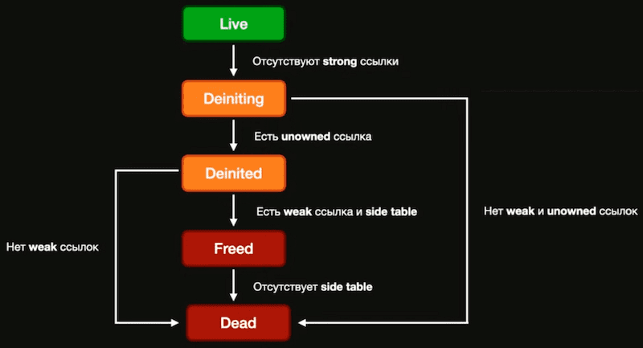

# Application memory

## Состояния приложения

✔️ <b>Design time</b> — когда разработчик пишет код или проектирует его.

✔️ <b>Compile time</b> — запускаем приложение на компиляцию сборку.

✔️ <b>Run time</b> — выполнение приложения, ошибки в runtime- ошибки у пользователя.

## Память

<b>Память</b> - это очень длинная последовательность <b>бит</b>.

8 <b>бит</b> = 1 <b>байт</b>

8 <b>байт</b> = 1 <b>слово</b>

## Адрес и указатель

У каждого байта есть <b>адрес</b>

За одно обращение к памяти, мы модем получить 8 байт сразу

<b>Указатель</b> - это переменная, в которой хранится адрес памяти другой переменной

## Адресное пространство

Адресное пространство приложения iOS состоит из четырех сегментов

✔️ <b>Сегмент Инструкций</b> содержит машинные инструкции, которые создаются компилятором, когда мы запускаем сборку приложения.

✔️ <b>Сегмент Данных</b> хранит статические переменные Swift, константы и метаданные типов.

✔️ В <b>куче</b> хранятся объекты, у которых есть время жизни.

✔️ В <b>стеке</b> хранятся временные данные – параметры при вызове метода и его локальные переменные.

## Stack

<b>Stack</b> — это память, выделенная для потока выполнения.

Он организован по принципу «последним пришёл — первым вышел» (<b>LIFO</b>).

### Как работает stack

✔️ В точке вызова в стек помещаются параметры функции и адрес возврата.

✔️ Вызываемая функция во время работы размещает в нем локальные переменные.

✔️ По завершении работы, функция очищает стек от своих локальных переменных и сохраняет результат.

✔️ Возврат из функции считывает из стека адрес возврата и выполняет переход по этому адресу.

✔️ Либо перед, либо сразу после возврата из функции стек очищается от параметров.

## Heap

<b>Неар</b> - это память, используемая для динамического выделения памяти.

Неар используется, если неизвестен объем данных необходимый во время выполнения или если нужно выделить большой объем данных.

### Как работает heap

✔️ Сохраняется в оперативной памяти компьютера так же, как и stack.

✔️ Может иметь фрагментацию, когда есть много распределений и освобождений.

✔️ Выделением и освобождением блоков памяти в hеар занимается ARC.

✔️ Чтобы получить данные в hеар первым делом требуется найти с помощью «оглавления».

B heap хранятся данные динамических размеров, например, список, в который можно добавлять произвольное количество элементов.

## Stack vs Heap
1. 
И <b>Stack</b> и <b>Неар</b> размещаются в оперативной памяти.

2. 
Много S<b>tack</b> и одна <b>Heap</b>.

3. 
<b>Неар</b> используется, если не известен объем данных необходимый во время выполнения или если нужно выделить большой объем данных, в ней размещаются объекты reference type.

4. 
<b>Stack</b> используется, для потока выполнения и в нём размещаются объекты value type, размер которых известен ещё на этапе компиляции.

5. 
<b>Hеар</b> и <b>Stack</b> растут навстречу друг другу.

6. 
Затраты на выделение и освобождение памяти в <b>Неар</b> намного больше.

## value types & reference types
### value types

✔️ Tuple

✔️ Dictionary

✔️ Enum

✔️ Set

✔️ Array

✔️ Double

✔️ Int

✔️ String

✔️ Struct

### reference types

✔️ Class

✔️ Function

✔️ Closure

## Выбор между классом и структурой
### Как определить что использовать?

✔️ Это просто данные?

✔️ У него есть какое-то поведение?

✔️ Имеет ли смысл в копировании этих данных?

Будте внимательнее при использовании структуры! Особенно, когда ее содержимое является <b>ССЫЛОЧНЫМ ТИПОМ</b>

### Как выбрать?

Используйте <b>reference type</b>, когда:

1. Сравнение идентичности экземпляра с === имеет смысл.

2. Вы хотите создать общее изменяемое состояние.

Используйте <b>value type</b>, когда:

1. Сравнение данных экземпляра с == имеет смысл.

2. Вы хотите, чтобы копии имели независимое состояние.

3. Данные будут использоваться в коде в нескольких потоках.

### Кто где размещается?

Reference typ

<b>1. Reference typе</b> всегда размещаются в <b>hеар</b>

Компилятор Swift может продвигать reference type для размещения в стеке, когда их размер фиксирован или время жизни может быть предсказано. Эта оптимизация происходит на этапе генерации SIL (Swift Intermediate Language)

<b>Value type</b> может размещаться в <b>hеар</b>, когда:

1. При реализации протокола

2. При смешивании <b>value type</b> и <b>reference type</b>

3. <b>Generi</b>c c <b>value type</b>

4. <b>Escaping closur</b>e captures

5. <b>Inout</b> аргумент

При смешивании <b>value type</b> и <b>reference type</b>.

Обычно ссылка на класс хранится в структуре, а структура является полем класса.

## Memory Layout
### Управление памятью

✔️ <b>alloc</b> – для выделения памяти.

✔️ <b>retain</b> – для удержания ссылки объекта.

✔️ <b>release</b> – для освобождение ссылки объекта.

✔️ <b>autorelease</b> – для пометки на автоматическое освобождение ссылки объекта.

✔️ <b>dealloc</b> - освобождение памяти.

## Struct Allocation

Когда мы только объявляем нашу константу point1, то в стеке у нас выделяется память под это и указатель сдвигается.

Стоит создать вторую переменную point2, как в стеке у нас разместиться точная копия данных, а после присвоения point2.x = 5 данные изменяться.

## Class Allocation

Когда мы объявим нашу константу point1, в случае с классом, в куче будет найден подходящий по размеру блок памяти для размещения данных.

Далее данные будут записаны в кучу, а в стеке будет размещена ссылка на кучу, где лежит наш класс.

## Жизненный цикл объекта

## Memory Leaks

✔️ Увеличивает объем памяти.

✔️ Нежелательные побочные эффекты.

✔️ Краши.

## Memory Warnings

✔️ Вызывая <b>applicationDidReceiveMemoryWarning(_:)</b> B <b>AppDelegate</b>.

✔️ Вызывая <b>didReceiveMemoryWarning()</b> в каждом из активных <b>UViewController</b>.

✔️ С помощью <b>didReceiveMemoryWarningNotification</b> во все зарегистрированные <b>observers</b>.

✔️ Каждая из <b>dispatch queues</b> получает <b>warning</b> типа <b>DISPATCH_SOURCE_TYPE_MEMORYPRESSURE</b>.

Если системе не хватает свободной памяти и она не может восстановить её, завершив приостановленные приложения, <b>UIKit</b> отправляет предупреждение о нехватке памяти работающим приложениям..

## EXC BAD ACCESS

✔️ Использование памяти, которая была освобождена.

✔️ Попытка записи за конец массива или буфера другого типа.

✔️ Использование указателя, который не был инициализирован.

✔️ Bad access по причине гонок в многопоточности.

Всякий раз, когда вы встречаете EXC_BAD_ACCESS, это означает, что вы отправляете сообщение объекту, который уже был освобожден.

Exception Type: EXC_BAD_ACCESS (SIGSEGV)

Exception Subtype: KERN_INVALID_ADDRESS at 0x0000000000000000

