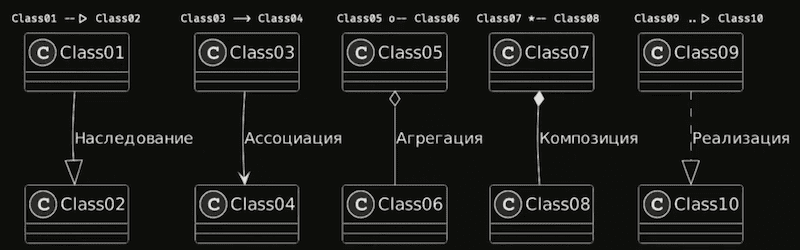

# UML

## Взаимосвязи

### Наследование

Это когда потомок разделяет структуру и поведение родителя и строится по спецификации его родителя.

### Ассоциация

Это струтурная связь между элементами модели, которая описывает набор связей, существующих между объектами. Это может быть вызов методов или взаимодействие с другими моделями.

### Агрегация

Это особая разновидность ассоциации, представляющая структурную связь целого с его частями.

### Композиция

Это форма агрегации с совпадением времени и жизни частей и целого.

### Реализация

Это семантическая связь между интерфейсами и классами, которые реализуют эти интерфейсы.

## Выводы
* 
Большие иерархии <b>наследования</b> и повсеместное использование <b>композиции</b>, обычно говорит о сильно связанном коде.

* 
Большое количество <b>наследования</b> говорит о проблемах с гибкостью кода, исправить которую можно предпочитая <b>агрегацию</b> <b>наследования</b>.

* 
Обилие же <b>композиции</b> говорит о нарушении DIP: предпочитайте <b>агрегацию</b> вместо <b>композиции</b>, поскольку первая стимулирует использование абстракций, а не конкретных классов.

* 
Отображать на диаграмме надо минимально необходимое количество деталей для понимания задачи.

* 
Если нет уверенности в том, какая связь между блоками, используйте ассоциацию.
