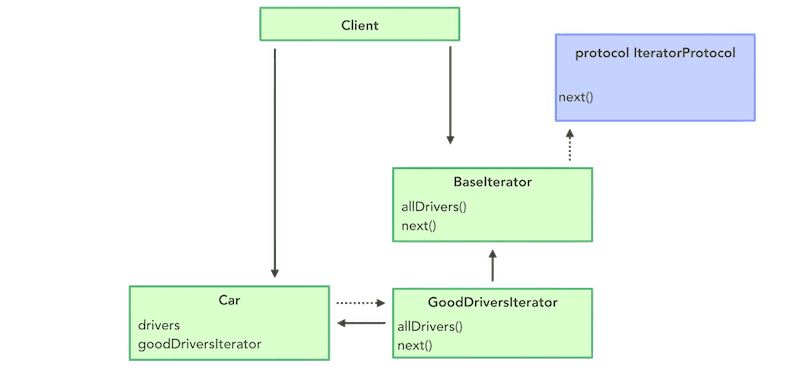
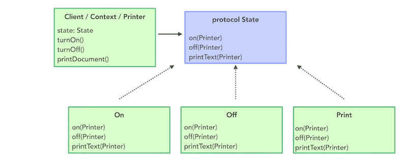
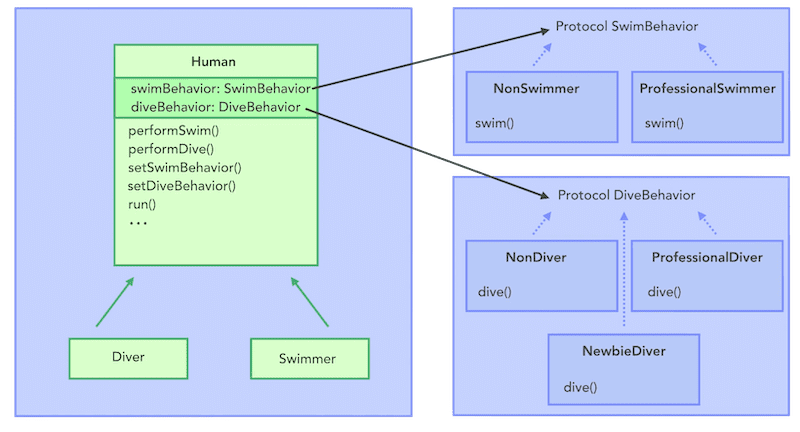

# Behavioral Design Patterns

Список поведенческих паттернов проектирования, которые решают задачи эффективного и безопасного взаимодействия между объектами программы.

## Chain of Responsibility

Позволяет передавать запросы последовательно по цепочке обработчиков. Каждый последующий обработчик решает, может ли он обработать запрос сам и стоит ли передавать запрос дальше по цепи.

## Command

Превращает запросы в объекты, позволяя передавать их как аргументы при вызове методов, ставить запросы в очередь, логировать их, а также поддерживать отмену операций.

## Iterator

Даёт возможность последовательно обходить элементы составных объектов, не раскрывая их внутреннего представления.

## Mediator

Позволяет уменьшить связанность множества классов между собой, благодаря перемещению этих связей в один класс-посредник.

## Memento

Позволяет сохранять и восстанавливать прошлые состояния объектов, не раскрывая подробностей их реализации.

## Observer

Создаёт механизм подписки, позволяющий одним объектам следить и реагировать на события, происходящие в других объектах.

## State

Позволяет объектам менять поведение в зависимости от своего состояния. Извне создаётся впечатление, что изменился класс объекта.

## Strategy

Определяет семейство схожих алгоритмов и помещает каждый из них в собственный класс, после чего алгоритмы можно взаимозаменять прямо во время исполнения программы.

## Template Method

Определяет скелет алгоритма, перекладывая ответственность за некоторые его шаги на подклассы. Паттерн позволяет подклассам переопределять шаги алгоритма, не меняя его общей структуры.

## Visitor

Позволяет добавлять в программу новые операции, не изменяя классы объектов, над которыми эти операции могут выполняться.

