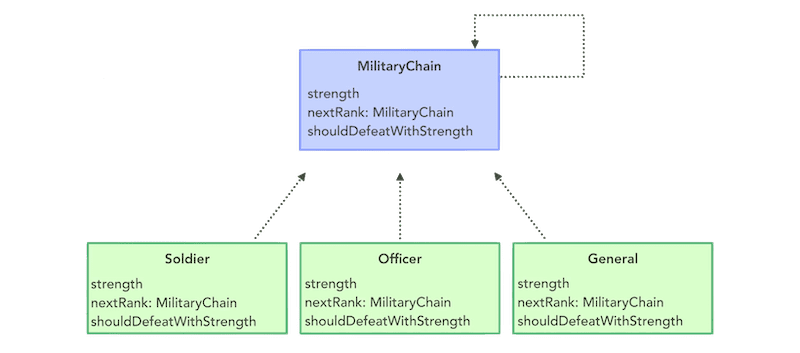
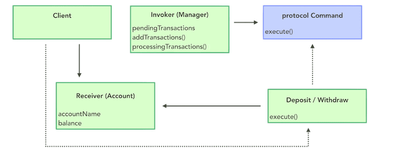
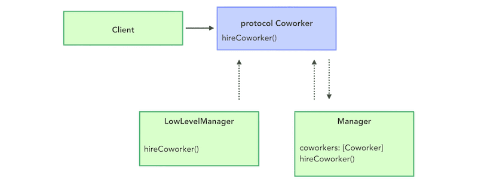
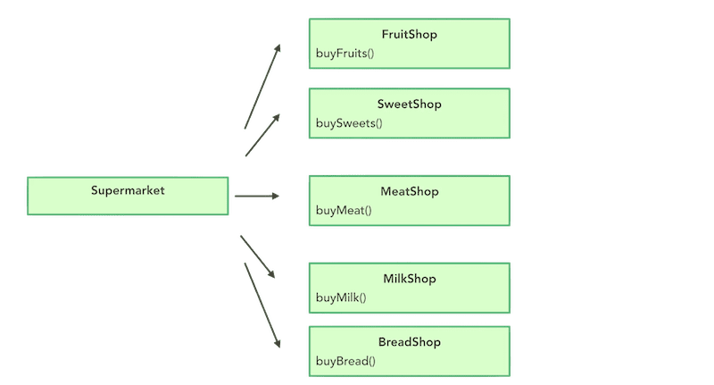
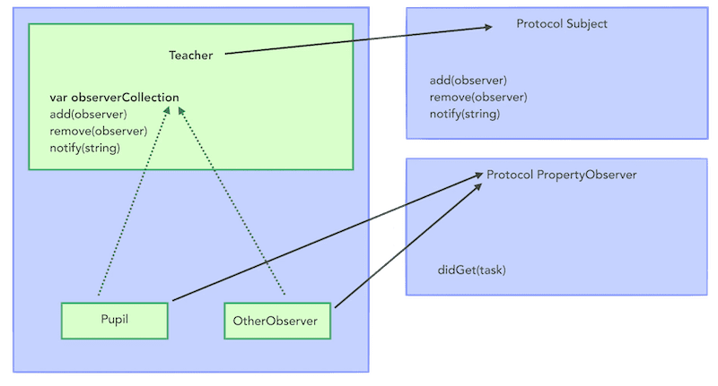
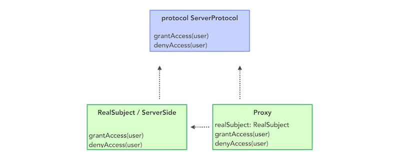
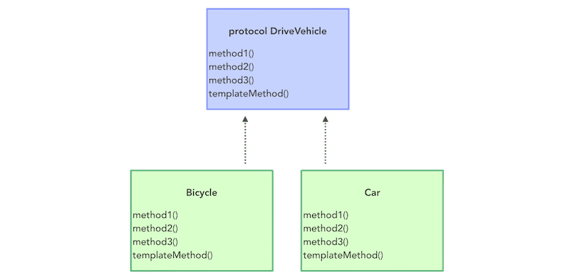

# Creational Design Patterns

## Abstract Factory

## Adapter

## Builder

## Chain of responsibility

## Command

## Composite

## Decorator

## Facade

## Factory Method

## Iterator

## Observer

## Proxy

## Simple Factory

## Singleton

## State

## Strategy

## Template Method
