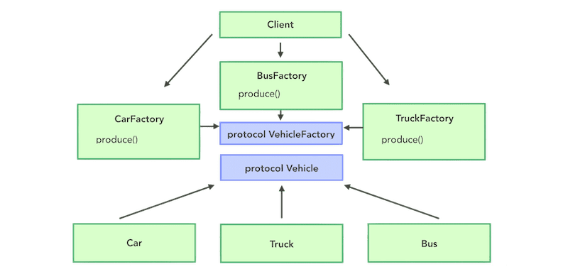
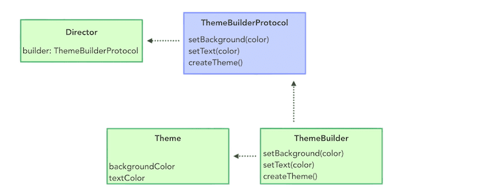
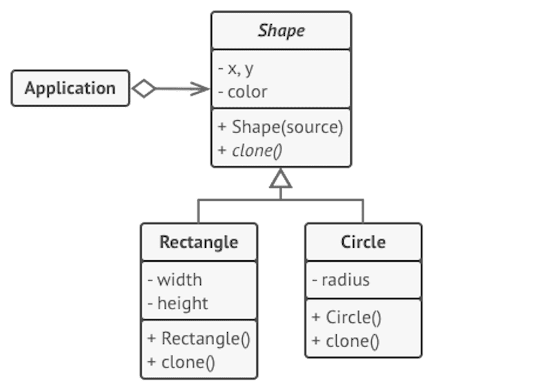

# Creational Design Patterns

Список порождающих паттернов проектирования, которые отвечают за удобное и безопасное создание новых объектов или даже целых семейств объектов.

## Simple Factory

Это класс, в котором есть один метод с большим условным оператором, выбирающим создаваемый продукт. Этот метод вызывают с неким параметром, по которому определяется какой из продуктов нужно создать. У простой фабрики, обычно, нет подклассов.

## Factory Method

Определяет общий интерфейс для создания объектов в суперклассе, позволяя подклассам изменять тип создаваемых объектов.

## Abstract Factory

Позволяет создавать семейства связанных объектов, не привязываясь к конкретным классам создаваемых объектов.

## Builder

Позволяет создавать сложные объекты пошагово. Строитель даёт возможность использовать один и тот же код строительства для получения разных представлений объектов.

## Prototype

Позволяет копировать объекты, не вдаваясь в подробности их реализации.

## Singleton

Гарантирует, что у класса есть только один экземпляр, и предоставляет к нему глобальную точку доступа.

