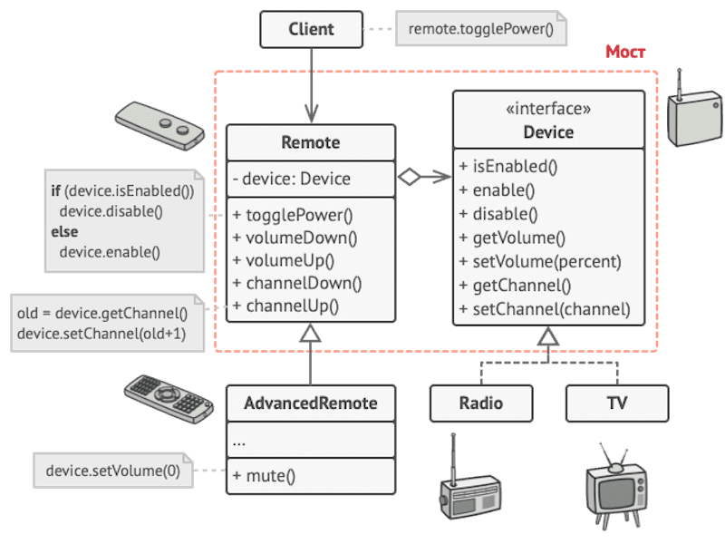
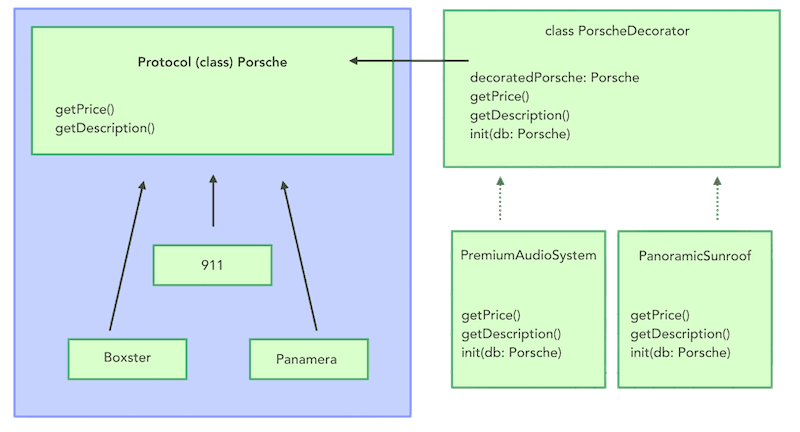

# Structural Design Patterns

Список структурных паттернов проектирования, которые отвечают за построение удобных в поддержке иерархий классов.

## Adapter

Позволяет объектам с несовместимыми интерфейсами работать вместе.

## Bridge

Разделяет один или несколько классов на две отдельные иерархии — абстракцию и реализацию, позволяя изменять их независимо друг от друга.

## Composite

Позволяет сгруппировать множество объектов в древовидную структуру, а затем работать с ней так, как будто это единичный объект.

## Decorator

Позволяет динамически добавлять объектам новую функциональность, оборачивая их в полезные «обёртки».

## Facade

Предоставляет простой интерфейс к сложной системе классов, библиотеке или фреймворку.

## Flyweight

Позволяет вместить бóльшее количество объектов в отведённую оперативную память. Легковес экономит память, разделяя общее состояние объектов между собой, вместо хранения одинаковых данных в каждом объекте.

## Proxy

Позволяет подставлять вместо реальных объектов специальные объекты-заменители. Эти объекты перехватывают вызовы к оригинальному объекту, позволяя сделать что-то до или после передачи вызова оригиналу.

