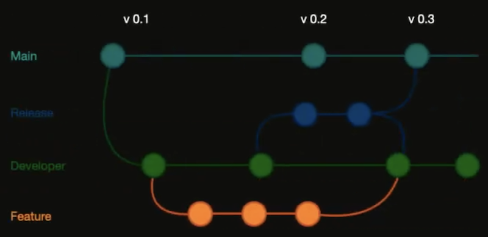

# Developer tools

## [SwiftLint](https://github.com/realm/SwiftLint)
<p align="justify"><b>SwiftLint</b> — это утилита от разработчиков Realm для автоматической проверки Swift-кода. Утилита содержит набор правил, основанных на GitHub's Swift Style Guide и здравом смысле. Разумеется можно добавлять свои правила.</p>

[File: swiftLint](resources/swiftlint.yml) 

```
sudo ln -s /opt/homebrew/bin/swiftlint /usr/local/bin/swiftlint
```

```swift
if which swiftlint > /dev/null; then
  swiftlint --fix && swiftlint
else
  echo "warning: SwiftLint not installed, download from https://github.com/realm/SwiftLint"
fi
```

## [SwiftGen](https://github.com/SwiftGen/SwiftGen)
<p align="justify"><b>SwiftGen</b> - это инструмент для автоматической генерации кода для ресурсов проектов. Он позволяет сократить время на разработку и избежать ошибок из-за человеческого фактора. </p>

## [LocalizableChecker](https://github.com/Jonathan-Gander/LocalizableChecker)
<p align="justify"><b>LocalizableChecker</b> — CLI утилита для проверки того, есть ли лишние ключи в файле Localizable.strings в вашем проекте.</p>
<p align="justify">Когда вы создаете приложение на разных языках, вы создаете множество ключей и значений перевода. Иногда вы удаляете какой-то код, но забываете удалить соответствующие ключи перевода. Ваш файл перевода становится все длиннее, и вы теряете время на перевод ключей, которые еще не используются в вашем приложении.</p>
<p align="justify">LocalizableChecker выводит все ключи, которые есть в файле перевода, но не используются в проекте.</p>

## [SourceDocs](https://github.com/SourceDocs/SourceDocs)
<p align="justify"><b>Source Docs</b> - это инструмент командной строки, который генерирует файлы документации markdown из встроенных комментариев к исходному коду.</p>

## [SwiftPlant UML](https://github.com/MarcoEidinger/SwiftPlantUML-Xcode-Extension)
<p align="justify"><b>SwiftPlant UML</b> - это утилита для автогенирация диаграмм из кода с расширениемдля Xcode. Создает диаграмму классов для кода Swift в Xcode или в Finder.</p>

## [Periphery](https://github.com/peripheryapp/periphery)
<p align="justify"><b>Periphery</b> - это утилита, которая сообщает о случаях неиспользованных объявлений. Periphery может идентифицировать простые обьявления без ссылок, например, класс, который больше не используется нигде в вашей системе.</p>

## Gitflow

<p align="justify"><b>Gitflow</b> - это набор расширений git предоставляющий высокоуровневые операции над репозиторием для поддержки модели ветвления.</p>

## [Bundler](https://bundler.io)
<p align="justify">Любая работа с gem зависимостями (git, pod, falstlane) должна вестись через <b>Bundler</b> - менеджером зависимостей. Это позволит избежать несовместимостей версий инструментов у всей команды.</p>

## [Tuist](https://github.com/tuist/tuist)
<p align="justify"><b>Tuist</b> — это open source инструмент для работы со структурой проекта.</p>
<p align="justify">Его основная функция — генерация Xcode-проектов из специальных файлов с описанием проекта в удобном формате. В терминологии Tuist эти файлы называются манифестами.</p>